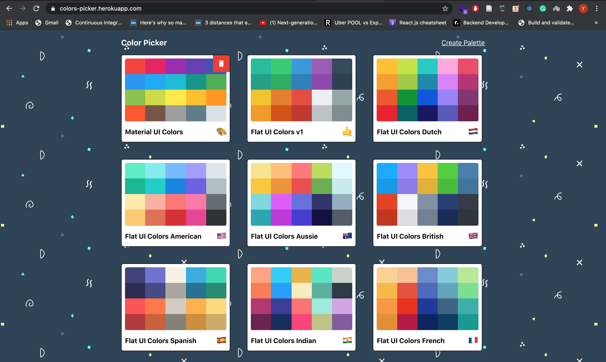
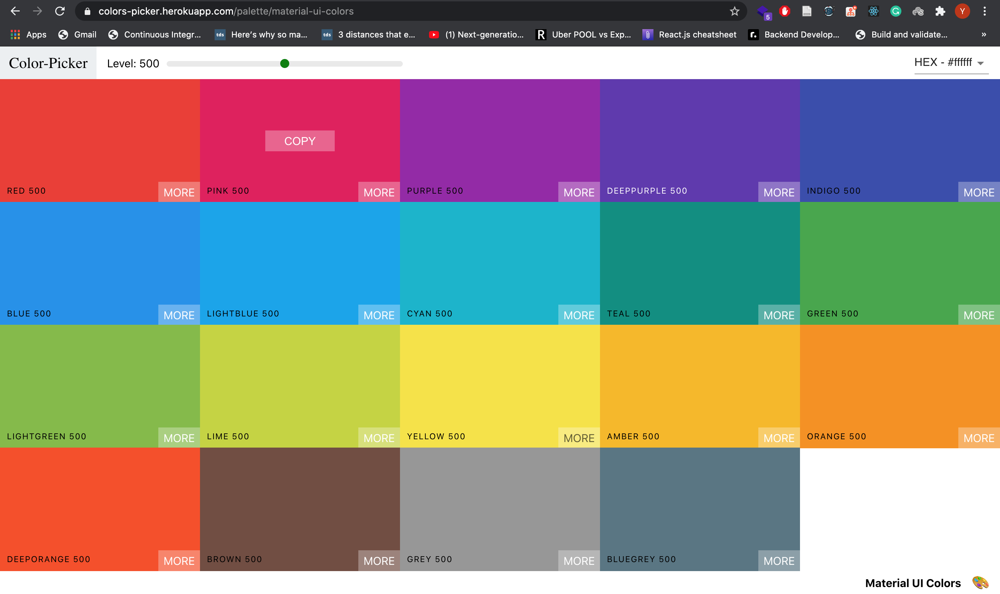
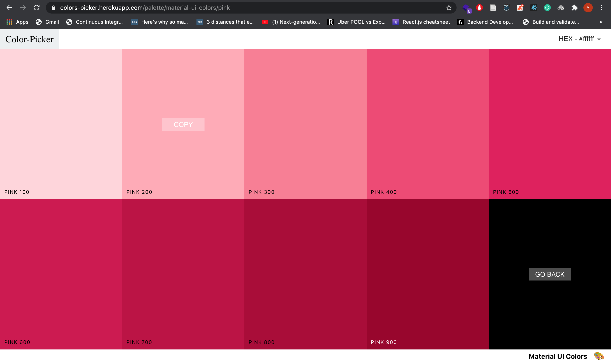
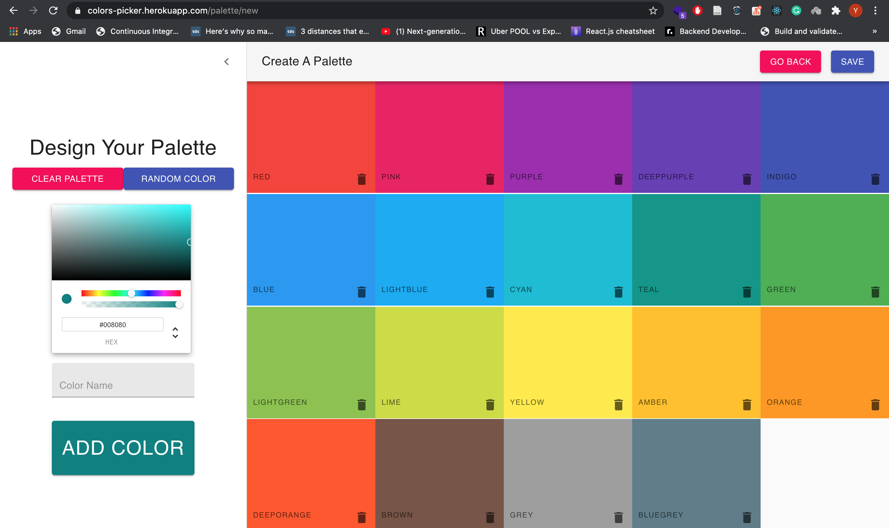
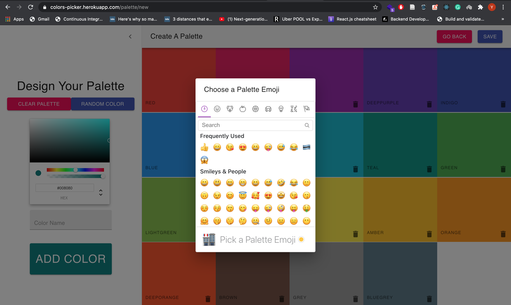

## Color-Picker
A clone website to [Flat UI Colors](https://flatuicolors.com/) or [Material UI Colors](http://materialuicolors.co/?utm_source=launchers) using react. 
Try it [here](https://colors-picker.herokuapp.com/).
## Evolution
This project has had major updates over it's life, might be intresting to look at them (checkout branches):
* Stage 1: Class based components only
* Stage 2: Functional components using hooks - [theOneWithHooks](https://github.com/younesZdDz/color-picker/tree/theOneWithHooks)
* Stage 3: Optimizations using react memo and useCallback - [theOneWithMemos](https://github.com/younesZdDz/color-picker/tree/theOneWithMemos)
* Stage 4: Code splitting, for smaller bundle sizes - [theOneWithCodeSplitting](https://github.com/younesZdDz/color-picker/tree/theOneWithCodeSplitting)
* Stage 5: ErrorBoundaries, for catching render errors - [theOneWithErrorBoundaries](https://github.com/younesZdDz/color-picker/tree/theOneWithErrorBoundaries)
* Stage 6: React Helmet, for custom headers(title and description) in each route - [theOneWithHelmet](https://github.com/younesZdDz/color-picker/tree/theOneWithHelmet)
* Stage 7: Switch to TypeScript - [theOneWithTypeScript](https://github.com/younesZdDz/color-picker/tree/theOneWithTypeScript)
## Screens

